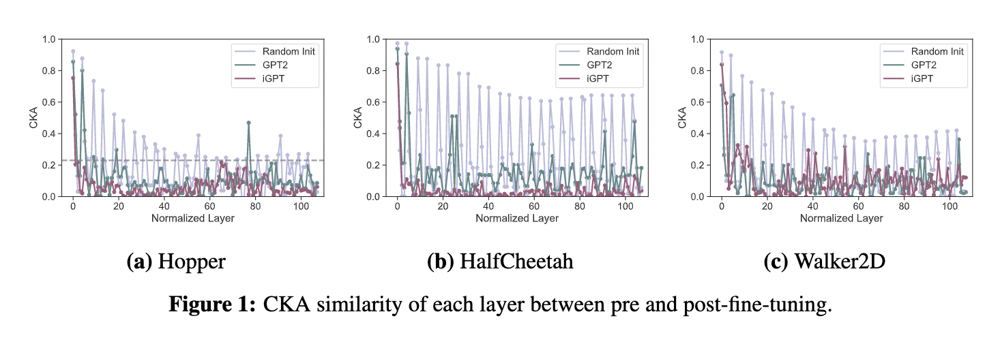
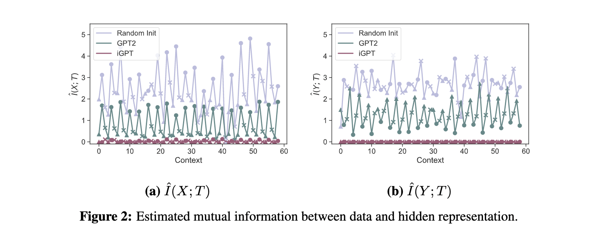
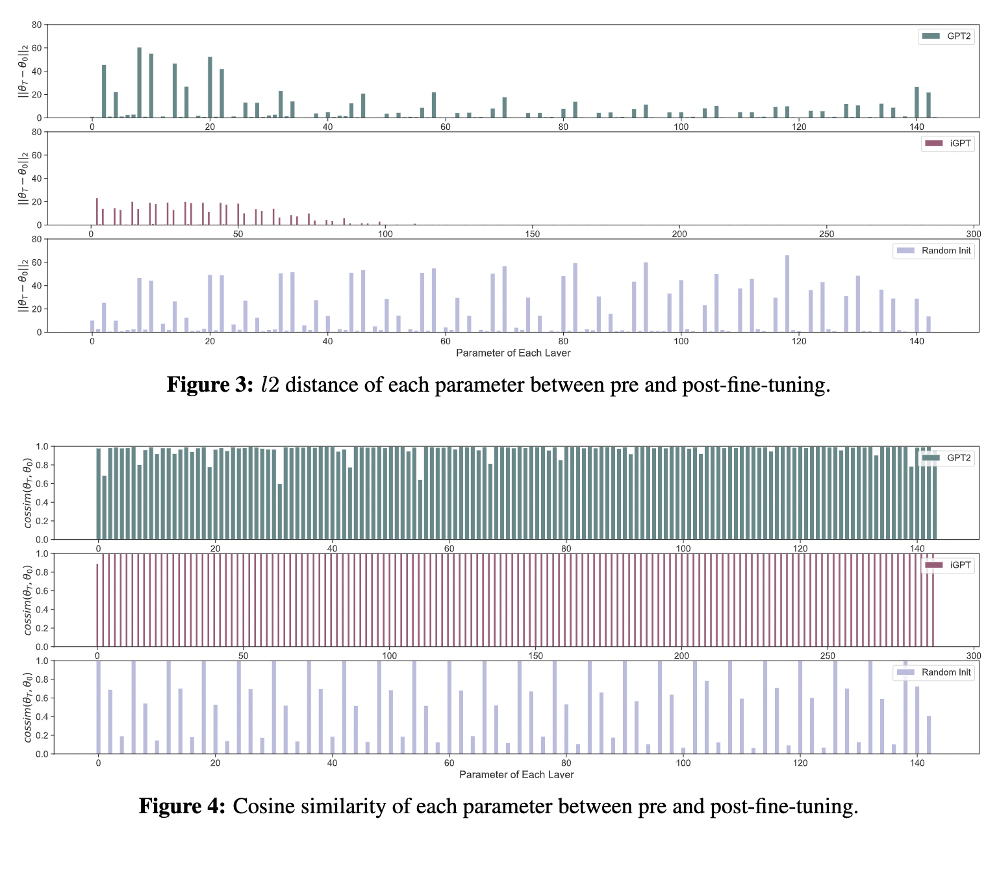
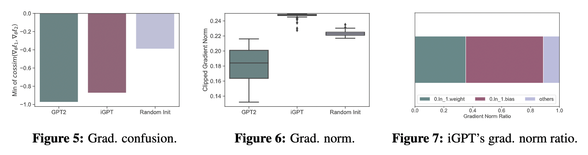
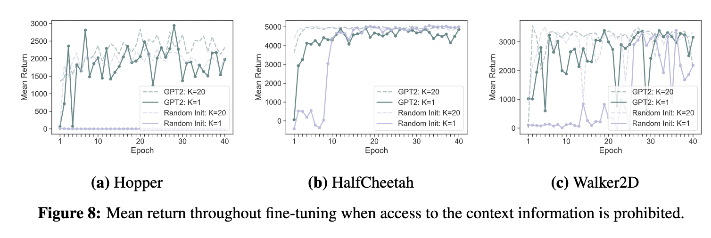
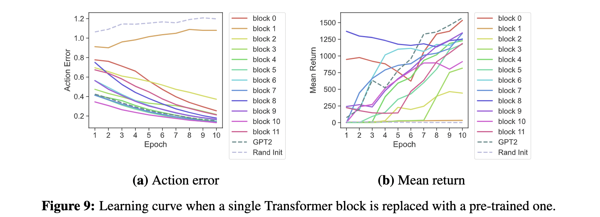
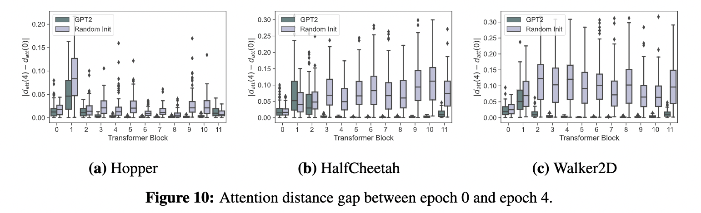
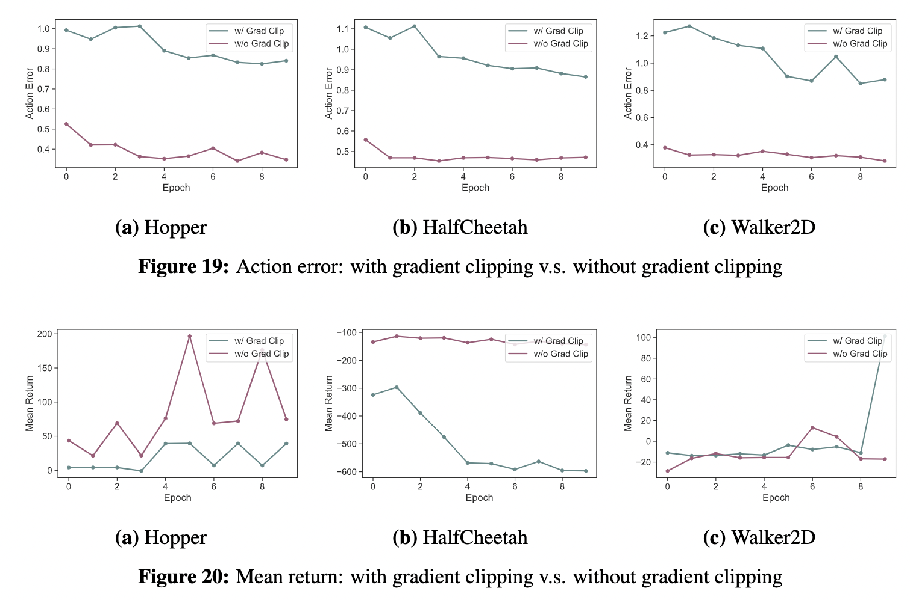
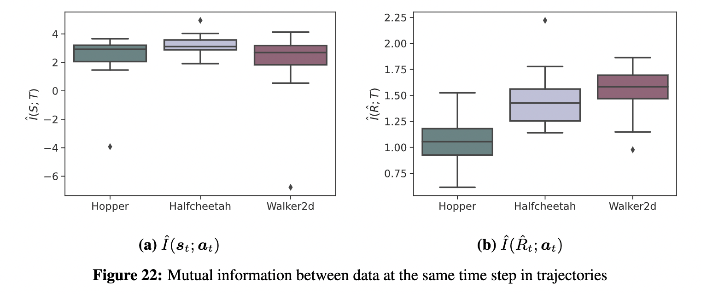

# On the Effect of Pre-training for Transformer in Different Modality on Offline Reinforcement Learning 
This repository contains the code for *"On the Effect of Pre-training for Transformer in Different Modality on Offline Reinforcement Learning"*. The LaTeX source for our paper is availabe at https://github.com/t46/paper-pre-training-different-modality-offline-rl.

Most of our code is based on the following repositories:
- https://github.com/machelreid/can-wikipedia-help-offline-rl
  - https://github.com/rail-berkeley/d4rl
- https://github.com/gtegner/mine-pytorch
- https://github.com/google-research/google-research/tree/master/representation_similarity

We sincerely thank the contributors for making the code available to us. Our research would not have been possible without these codes.

The primary files and directories used to generate the results of the paper are the following:
```
.
|-- can-wikipedia-help-offline-rl
|   |-- experiment.py
|   |-- analysis
|-- mine-pytorch
|   |-- run_mi_exp.py
```
The directory `can-wikipedia-help-offline-rl` contains the code for most of our experiments (Sections 5.1 - 5.6). The directory `mine-pytorch` contains only some of the code for mutual information estimation (Section 5.2). Unless otherwise noted, the following description assumes that you are in `pre-training-different-modality-offline-rl` directory.

We provide conda environments `mine` for mutual information calculation by MINE in `mine-pytorch` and `wikirl-gym` for the others in `can-wikipedia-help-offline-rl`. Therefore, unless otherwise noted, assume that you are activating the respective conda environment when you are in the respective directories.

## Setup for `can-wikipedia-help-offline-rl`

### Install MuJoCo
Our experiments use the mujoco task in D4RL, a benchmark task for offline reinforcement learning. Therefore, first install the mujoco.

D4RL (`6330b4e`) depends on `mujoco-py` (2.1.2.14) which requires `mujoco210`. Thus, install `mujoco210` following the instruction of [the repository](https://github.com/openai/mujoco-py) of `mujoco-py`. We excerpted the instruction from the repository below:
> Download the MuJoCo version 2.1 binaries for [Linux](https://mujoco.org/download/mujoco210-linux-x86_64.tar.gz) or [OSX](https://mujoco.org/download/mujoco210-macos-x86_64.tar.gz).
>
> Extract the downloaded `mujoco210` directory into `~/.mujoco/mujoco210`.
>
> If you want to specify a nonstandard location for the package, use the env variable `MUJOCO_PY_MUJOCO_PATH`.

### Create and activate `wikirl-gym` environment

```
cd can-wikipedia-help-offline-rl
conda env create -f conda_env.yml
conda activate wikirl-gym
```

### Install D4RL
```
cd data
git clone https://github.com/rail-berkeley/d4rl.git
cd d4rl
```
D4RL (`6330b4e`) depends on `dm-control` and `mujoco-py`. While the latest version of `dm-control` (1.0.7) requires `mujoco-2.1.1`, that of `mujoco-py` (2.1.2.14) requires `mujoco210`. Therefore, you should downgrade `dm-control` so that you use D4RL with `mujoco210` (See the [reference](https://github.com/Farama-Foundation/D4RL/issues/144)).

To that end, edit `setupy.py` in the cloned D4RL repository. Specifically, change `'dm_control>=1.0.3'` in `setupy.py` to `'dm_control @ git+https://github.com/deepmind/dm_control@644d9e0047f68b35a6f8b79e5e8493e2910563af'`.

After that, run the following:
```
pip install -e .
```

### Download data of D4RL
```
python download_d4rl_datasets.py
```
This command downloads data as `{env-name}-{data-type}-v2.pkl` in `can-wikipedia-help-offline-rl/data` directory. You use this directory as the path to load the dataset for experiments and analysis (e.g. `data_path` in `experiment.py`).  

```
cd ..
conda deactivate wikirl-gym
```

## Setup for `mine-pytorch`
### Create `mine` environment
```
cd mine-pytorch
conda env create -f conda_env.yml
cd ..
```


## Run Fine-Tuning
To replicate the analysis done in the paper, train/fine-tune the model first with the mujoco data. Before that, activate wandb. This will allow you to save the results of the experiment to wandb.
```
wandb login
cd can-wikipedia-help-offline-rl
```

The script to run the fine-tuning `experiment.py` is just under `can-wikipedia-help-offline-rl`. Run the following command to train the *randomly initialized model* used in Section 5.1 - 5.4 (context K=20). 
```{sh}
python experiment.py \
--env hopper \
--dataset medium \
--model_type dt \
--seed 666 \
--outdir checkpoints \
--dropout 0.2 \
--share_input_output_proj \
--warmup_steps 5000 \
--embed_dim 768 \
--n_layer 12 \
-w
```
For pre-trained models, add `--pretrained_lm gpt2` for *language-pre-trained model (GPT2)* and `--pretrained_lm openai/imagegpt-small` for *image-pre-trained model (iGPT)*. Running command above outputs per epoch i) fine-tuned models under `./checkpoints` directory, i.e. `checkpoints/dt_medium_hopper_666/model_40.pt` and ii) results such as mean return and action error to wandb. For sanity check in Section 4, run `sanity_check_preformance.ipynb` after running the above command (Table 1). Run the command for all environments (`--env`: `hopper`, `halfcheetah`, and `walker2d`) and all types of models (`--pretrained_lm`: "not added", `gpt2`, and `openai/imagegpt-small` ), respectively.

For the results of Section 5.5 and 5.6.2 (context K=1), just add `--K 1` option. For block replacement experiment (Section 5.6.1), In addition to `--K 1`, add `--pretrained_block {replaced_block_id}` and `--max_iters 10`. You run the command for all environments (`--env`: `hopper`, `halfcheetah`, and `walker2d`), two types of pre-trained models (`--pretrained_lm`: "not added" and `gpt2`), and all block ids (`--pretrained_block`: 0, ..., 11) respectively.

## Analysis
The codes for all analyses, except for the mutual information estimation, are under `can-wikipedia-help-offline-rl/analysis`. For those that require data sampling for analysis, we provide python scripts in addition to jupyter notebooks. Both scripts and notebooks perform the same analysis.
### 5.1 Activation Similarity

The script and notebooks for activation similarity analisis are in `analysis/section-51-activation-similarity`.
- `compute_cka.ipynb` (`compute_cka.py`)
  - Compute CKA between activations of two models, which output the CKA values used to plot Figure.1.
- `plot_cka.ipynb`
  - Plot Figure.1 from the CKA values save in `compute_cka.ipynb`.
### 5.2 Mutual Information Between Hidden Representation and Data

The code to run mutual information estimateion by MINE is in `mine-pytorch` and the notebook and script for activation similarity analisis are in `analysis/section-52-mutual-information`

- `mutual_information.ipynb`
  - Plot Figure 2 and 16 from estimated mutual information by `mine-pytorch/run_mi_exp.py`.
- `save_activation.ipynb`
  - Save hidden representation used to estimate mutual information in `mine-pytorch/run_mi_exp.py`.

The steps for mutual information estimation are following:
1. Run `save_activation.py` and save activation into a directory. The directory where the activation is stored is referenced when running `mine-pytorch/run_mi_exp.py`.
2. Run the code below for mutual information estimation:
    ```
    cd mine-pytorch
    conda activate mine
    python run_mi_exp.py \
    --path_to_save_mi YOUR_SAVE_PATH \
    --path_to_data YOUR_DATA_PATH \
    --path_to_activation YOUR_ACTIVATION_PATH
    conda deactivate mine
    cd ../can-wikipedia-help-offline-rl/analysis/section-52-mutual-information
    ```
    For the result of Appendix E.3, add `--exp_type no_context` option.

3. Run `mutual_information.ipynb` to plot the figure.
### 5.3 Parameter Similarity

The notebook for activation similarity analisis is in `analysis/section-53-parameter-similarity`.
- `parameter_similarity_analysis.ipynb`
  - Compute parameter similarity and plot Figures 3 and 4.
### 5.4 Gradient Analysis

The notebooks and scripts for gradient analisis are in `analysis/section-54-gradient-analysis`.
- `grad_confusion.ipynb` (`compute_grad_confusion.py`)
  - Plot Figure 5.
- `grad_norm.ipynb` (`compute_grad_norm.py`)
  - Plot Figures 6 and 7.
### 5.5 Fine-Tuning With No Context Information


tebook to plot the results of fine-tuning with no context is in `analysis/section-55-fine-tuning-no-context`.
- `plot_learning_curve_no_context.ipynb`
  - Plot Figures 8 and 9
    - Note that Figure 9 is created by this notebook, though Figure 9 is in Section 5.6.
  - Obtain the result to create Table 2.
### 5.6 More In-Depth Analysis of Context Dependence

The notebook and script for attention distance analisis are in `analysis/section-56-dependence-on-context`.
- `attention_distance.ipynb` (`compute_attention_distance.py`)
  - Plot Figure 10.

## Analysis done during rebuttal period
The following two analyses are done during rebuttal period, the result of which are in Appendix.

### G.3 Analysis of the Effect of Gradient Clipping

Run `experiment.py` with `--remove_grad_clip` option.
```{sh}
python experiment.py \
--env hopper \
--dataset medium \
--model_type dt \
--pretrained_lm openai/imagegpt-small \
--seed 666 \
--outdir checkpoints \
--dropout 0.2 \
--share_input_output_proj \
--warmup_steps 5000 \
-w \
--max_iters 10 \
--remove_grad_clip 
```
Then, plot the figures in the jupyter notebook. The notebook for this analysis is in `analysis/section-54-gradient-analysis`.
- `plot_learning_curve_grad_clip.ipynb`
  - Plot Figures 19 and 20.

### H.2 Analysis of Why Randomly Initialized Model Fails for Hopper with No Context

The notebook for comparing mutual information of different data type is in `analysis/section-52-mutual-information`.

- `mutual_information_data.ipynb`
  - Plot Figure 22.

1. Run `run_mi_exp.py` with `--exp_type data` option.
    ```
    cd mine-pytorch
    conda activate mine
    python run_mi_exp.py --exp_type data 
    conda deactivate mine
    cd ../can-wikipedia-help-offline-rl/analysis/section-52-mutual-information
    ```
2. Run `mutual_information_data.ipynb` to plot figures.

## License

MIT
